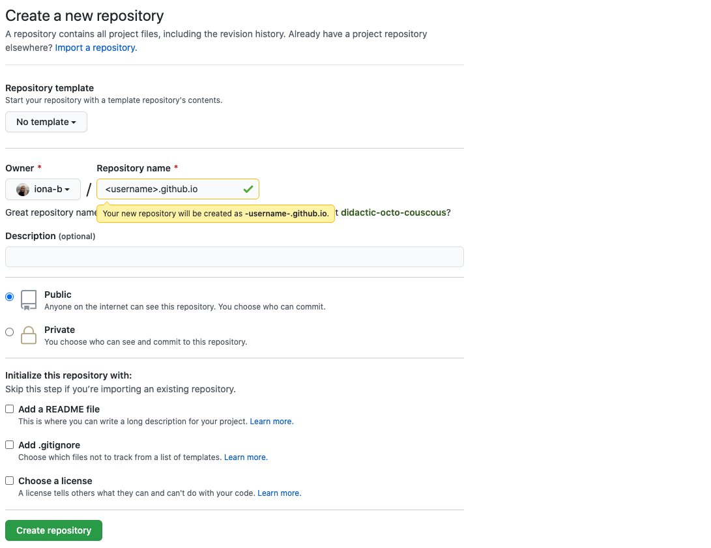
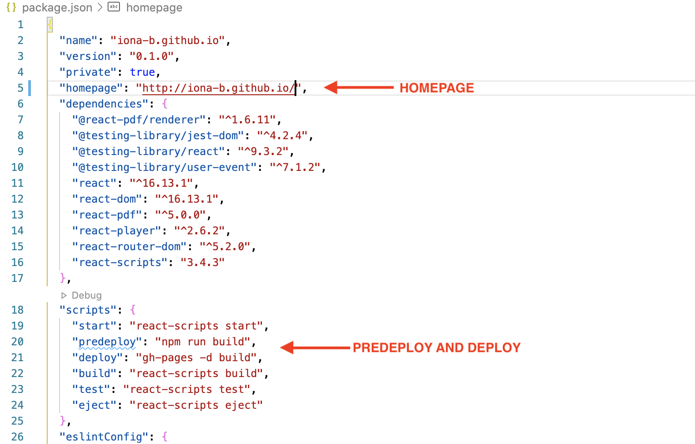
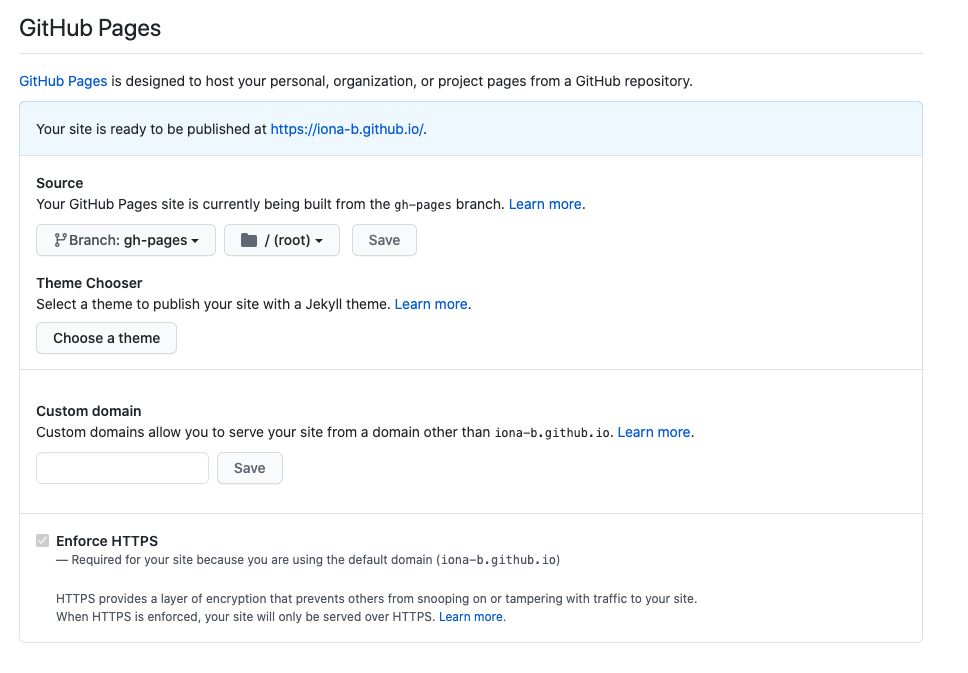

*photo by [@lum3n](https://unsplash.com/@lum3n)*

# Creating a Portfolio Website Using GitHub Pages and React: Part 2

**Part 1 is available [here](https://dev.to/ionabrabender/creating-a-portfolio-website-using-github-pages-and-react-part-1-1mm4).**

As a budding software engineer, I decided to create a portfolio website so that I had more opportunity to share my experience and projects and because it was a great way to keep developing my coding skills. In this series of blog posts, I'll be talking about why I created my portfolio website using GitHub Pages and React.js and what steps I took to achieve this. **In this post I'll be working my way through creating an initial React app and getting it online using GitHub Pages.**

**Click [here](ionabrabender.com) to see the website I've created using GitHub Pages and React.**

<br></br>
***
<br></br>

## Step 1: Getting Set Up

If you've already created an app using React and have worked with GitHub before, it's likely that you already have a good setup in terms of what you need to get started, so you may want to skip straight to step 2. Here, I'll quickly go over what tools are absolutely necessary for this process. I've also suggested resources you can use as a guide for certain actions, but there are many more options out there, so feel free to do some searching of your own if you feel like anything's still unclear.

### 1. A GitHub Account
You can sign up for a free GitHub account at [github.com](https://github.com/).

### 2. Install Git on Your Machine
Git comes pre-installed as standard with most operating systems, but you can check by running ```git version``` in your terminal to see if it returns a version number. If it doesn't, you'll need to go ahead and install it and you can find a comprehensive guide for GitHub Desktop, MacOS, Windows, and Linux users [here](https://github.com/git-guides/install-git).

### 3. Set Up GitHub Correctly
Once you've set up your GitHub account and have installed Git on your computer, you'll need to make sure you've configured everything correctly and have added your SSH key to your account. Mac users can find information on this [here](http://burnedpixel.com/blog/setting-up-git-and-github-on-your-mac/) and Windows users can look at [this guide](https://medium.com/@aklson_DS/how-to-properly-setup-your-github-repository-mac-version-3a8047b899e5).

### 4. Install Node.js and npm
[Node.js](https://www.freecodecamp.org/news/what-exactly-is-node-js-ae36e97449f5/) is a runtime environment and is used to execute programs written using JavaScript. [npm]((https://www.w3schools.com/whatis/whatis_npm.asp)) works as a software library, a package manager, and an installer. It's open-source, contains almost 1 million packages, and is a great way for developers to share code. You can download Node.js from the official website [here](https://nodejs.org/en/).

### 5. Select Your Text Editor
You'll need to have a text editor installed in order to edit your code. I really like using [Visual Studio Code](https://code.visualstudio.com/), but you're free to use whatever you're most comfortable with.

<br></br>

## Step 2: Creating Your GitHub Repository
Once you've set up your environment, the next step is to create the repo which will contain your website files. After logging into your GitHub account, click the button to [create a new repository](https://github.com/new). In order for GitHub Pages to work correctly, you'll need to name this repo using the following format: username.github.io, where the username is your **exact GitHub username**. In this case, mine would be iona-b.github.io.



*Creating your repository in GitHub*

<br></br>

## Step 3: Creating Your Initial React App
At this point, we won't be creating a fully-functioning React app. We just want to reach the stage where we can get our site online and we'll build it out further later on. If you're familiar with React, you may already want to add a simple "under construction" notice, just in case anybody does come looking, and it's probably wise not to post your URL anywhere until you're completely happy with your work.

To initialise your React app, cd into whichever directory you want to work in on your computer and run ```npm init react-app <whatever-you-want-to-name-your-app>```. This will create all of the files you need to get started.

<br></br>

## Step 4. Install GitHub Pages as a Dev-Dependency

Dependencies in React are reusable components created by developers which give you access to interesting libraries and functionality. In order for your site to work, you'll need to install [gh-pages](https://www.npmjs.com/package/gh-pages), which you can do by cd-ing into your React app and running ```npm install gh-pages --save-dev```.

<br></br>

## Step 5: Update Your package.json File
When you initialise your app, you'll notice that a package.json file is automatically generated for you. This is a JSON file that is used to manage the project's dependencies, scripts, and versions. To make sure your website can deploy properly, there are three lines of code we'll need to add.

### 1. Add a Home Page
In the first section of the package.json file, add a homepage, for instance: ```"homepage": "http://iona-b.github.io/"```.

### 2. Add Predeploy
In the scripts section, add a predeploy, for instance: ```"predeploy": "npm run build"```

### 3. Add Deploy
Also in the scripts section, add a deploy, like so: ```"deploy": "gh-pages -d build"```

Your additions should look something like this:

<br></br>



*Your updated package.json file*

<br></br>

## Step 6: Push to GitHub

Once you've completed the above steps, you should push your changes to GitHub. To do so, you can run the following commands:

```
git init
git add .
git commit -m "first commit"
git branch -M main
git remote add origin <repository URL>
git push -u origin main
```

<br></br>

## Step 7: Deploy

Now it's time to get your app online! Simply run ```npm run deploy``` and the scripts you added to your package.json file should kick into action.

<br></br>

## Step 8: Update Your Repository Settings

Go to settings in your repository and look at the GitHub Pages section. Underneath the Source heading, you should have the option to select which branch the site is being built from. Change the branch to gh-pages. This way, your repository will know what files you want to use to build your website.



*Updating your settings in your GitHub repository*

<br></br>

## Step 9: Celebrate Your Success in Building Your Website!!
Your site should now be available at your-username.github.io/. Sure, it's not quite a full-blown portfolio website yet, but you've done the hard work and now you can start on the fun part!


*photo by [@amyshamblen](https://unsplash.com/@amyshamblen)*


<br></br>
***
<br></br>

In the next post, I'll be looking more at the React app itself and how we can use it to create an effective portfolio website. See you then!


## Sources
1. "[Getting Started with GitHub Pages](https://guides.github.com/features/pages/)", GitHub Guides, Accessed October 16 2020
2. "[Install Git](https://github.com/git-guides/install-git)", Git Guides, Accessed October 16 2020
3. "[Understanding the package.json file](https://www.blog.ezekielekunola.com/understanding-the-package.json-file)", Tech Digests, Accessed October 16 2020
4. "[Beginner's Setup Guide for Git & Github on Mac OS X](http://burnedpixel.com/blog/setting-up-git-and-github-on-your-mac/)", burnedpixel, Accessed October 16 2020
5. "[What exactly is Node.js?](https://www.freecodecamp.org/news/what-exactly-is-node-js-ae36e97449f5/)", freeCodeCamp, Accessed October 16 2020
6. "[What is npm?](https://www.w3schools.com/whatis/whatis_npm.asp)", w3schools, Accessed October 16 2020
7. "[How to build and deploy a React app to Github pages in less than 5 minutes](https://medium.com/mobile-web-dev/how-to-build-and-deploy-a-react-app-to-github-pages-in-less-than-5-minutes-d6c4ffd30f14)", Anjali Sharma on Medium, Accessed October 16 2020
8. "[How to deploy React App to GitHub Pages](https://dev.to/yuribenjamin/how-to-deploy-react-app-in-github-pages-2a1f)", Ibrahim Ragab on DEV, Accessed October 16 2020