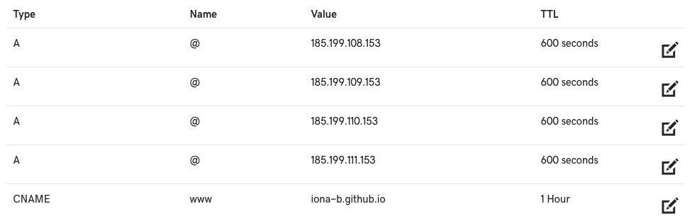
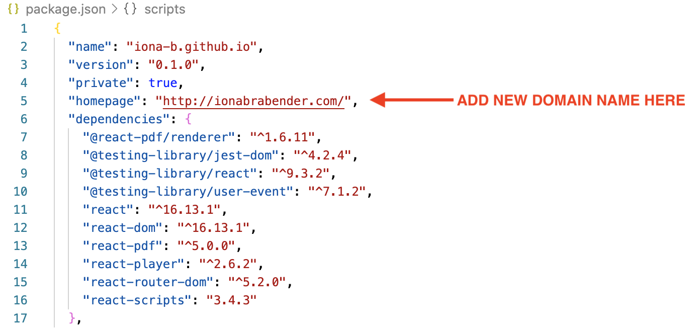
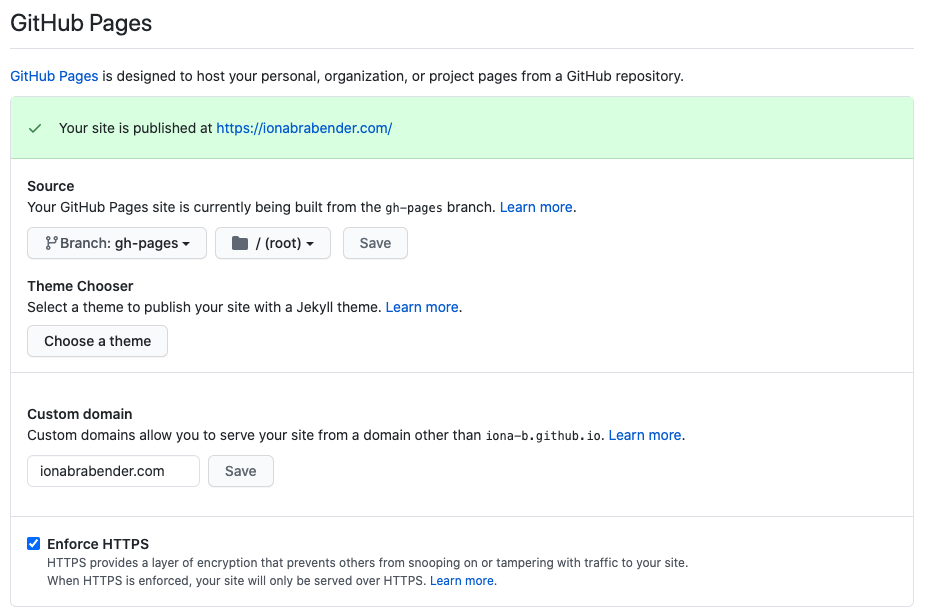

*photo by [@sincerelymedia](https://unsplash.com/@sincerelymedia)*

# Creating a Portfolio Website Using GitHub Pages and React: Part 3

**Part 1 is available [here](https://dev.to/ionabrabender/creating-a-portfolio-website-using-github-pages-and-react-part-1-1mm4).**
**Part 2 is available [here](https://dev.to/ionabrabender/creating-a-portfolio-website-using-github-pages-and-react-part-2-16e1).**

As a recent software engineering graduate, I decided to create a portfolio website as a way to show what I can do as well as improve my coding skills. While a custom domain name is completely optional, it can be a good way to personalise your website and to make it look more professional. **In this post I'll be looking at how I set up my custom domain name and added it to my GitHub Pages and React website.**

**Click [here](https://ionabrabender.com/) to see the website I've created using GitHub Pages and React.**

<br></br>
***
<br></br>

## Why Use a Custom Domain?

When you create your GitHub Pages website, it will automatically be published at username.github.io. Mine would be iona-b.github.io. This URL looks pretty professional, so it's not a problem if you're happy using the standard version, however there are a couple of reasons why you might want to use a custom domain.

### 1. It Makes Your Website Look More Professional

Using the github.io version doesn't look bad by any means, but having your own custom domain site shows that you've really thought about your portfolio website and that you're a professional developer.

### 2. It Can Help You Strengthen Your Brand

When you created your GitHub account, you may have chosen a username that's not completely recognisable as you. In this case, a custom domain is a really good idea as it will allow visitors to your site to immediately associate it with you.

### It Can Be Free or Relatively Inexpensive

Most domain registrars offer your first domain registration at a relatively low price and some will even give you the first couple of months or years for free. You should definitely look carefully at the terms of any sort of agreement but having a domain personalised exactly how you want it is definitely worth it for a low price.

## How to Get Your Domain Name

Setting up a custom domain for your GitHub Pages site is pretty straightforward.

### 1. Choose a Domain Registrar

There are many options available for registering your domain name and most options are relatively cheap, with some even being free. You can find an overview of some of the most highly-rated domain name registrars [here](https://hostingfacts.com/domain-registrars/) and you should definitely look around to see which fits you best.

### 2. Decide on a Domain Name

Generally, when it comes to choosing a domain name, you want to go for something simple. As with any professional online platform (for instance, GitHub, LinkedIn, or a blog), just using your name is probably the best idea. If you have a common name, this might already be registered, so try to go for something straightforward and professional.

### 3. Set up Your Domain Name System (DNS)

The [Domain Name System (DNS)](https://www.cloudflare.com/learning/dns/what-is-dns/) is a naming system for computers and other resources connected to the internet and is responsible for translating domain names to IP addresses, which in turn allows your browser to load the resources at that IP address.

Once you've registered your domain, it's likely that you'll need to set it up correctly to be able to use it. As I used [GoDaddy](https://www.godaddy.com/offers/brand/repeat?isc=goodbr01&gclid=CjwKCAjw_sn8BRBrEiwAnUGJDqZz7ciO66I91q57s-7fVxRyhhGnnjm08IBfArEepTcUNbdbRNvJiRoC2_wQAvD_BwE&gclsrc=aw.ds) for my domain name, I'll be explaining specifically how to configure your DNS settings using GoDaddy. If you've chosen a different domain registrar, you may need to search for instructions specific to that service, however the rest of this guide should still be relevant.

Go to the DNS Management Page for your chosen domain and make the following changes:

1. In the Type A row, update the value to 185.199.108.153. This allows your domain name to point to the GitHub server.
2. Add another Type A row and use the IP address value of 185.199.109.153.
3. Add another Type A row and use the IP address value of 185.199.110.153.
4. Add another Type A row and use the IP address value of 185.199.111.153.
5. Add your GitHub Pages URL as the value for the Type CNAME row. For me, this would be iona-b.github.io.

Once you've made those changes, your finalised DNS Management page should look something like this:



*Updated DNS Management Page*

### 4. Add Your Domain Name to Your App

Once you've correctly configured your DNS settings, go to the package.json file for your app. When you initially set this up, you probably added your version of ```"homepage": "http://iona-b.github.io/"``` to the first section of the file. You can now update this with your new domain name. It should end up looking something like this:



*Add Domain Name to package.json*

### 5. Add Your Domain Name to Your Repository

Finally, you just need to add your domain name to your repository. Go to the GitHub Pages section of your repository and add your new domain name to the Custom Domain Section and save. The updated page should look like this: 



*Add Domain Name to GitHub Repository*

And that's it! You should now be able to access your website at your custom domain.

<br></br>
***
<br></br>

In the next post, I'll be looking more at the React app itself and how we can use it to create an effective portfolio website. See you then!

**Part 1 is available [here](https://dev.to/ionabrabender/creating-a-portfolio-website-using-github-pages-and-react-part-1-1mm4).**
**Part 2 is available [here](https://dev.to/ionabrabender/creating-a-portfolio-website-using-github-pages-and-react-part-2-16e1).**

## Sources
1. "[Configuring a custom domain for your GitHub Pages site](https://docs.github.com/en/free-pro-team@latest/github/working-with-github-pages/configuring-a-custom-domain-for-your-github-pages-site)", GitHub Docs, Accessed October 23 2020
2. "[GoDaddy Domain with GitHub Pages](https://medium.com/@JinnaBalu/godaddy-domain-with-github-pages-62aed906d4ef)", Jinna Balu on Medium, Accessed October 23 2020
3. "[10 Best Domain Registrars](https://hostingfacts.com/domain-registrars/)", HostingFacts, Accessed October 23 2020
3. "[What is DNS?](https://www.cloudflare.com/learning/dns/what-is-dns/)", Cloudflare, Accessed October 23 2020