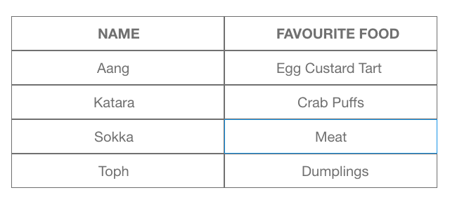
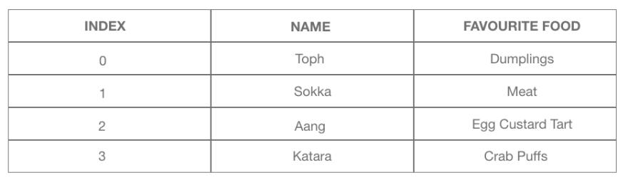
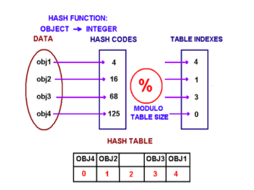
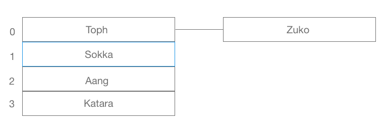
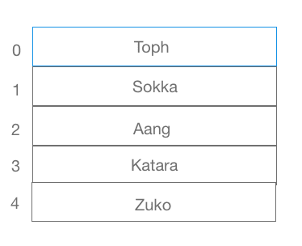
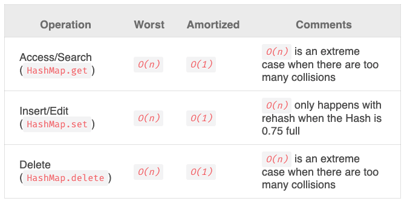

# Hashing It Out in JavaScript

Hashmaps are a type of data structure used in computer science to format, organise, and manage data. In this blog post, we'll take a look at why we use them, how they work, and what the advantages and disadvantages can be. Additionally, we'll also quickly examine the introduction of Map to JavaScript with ES6.

</br>

## What is a hashmap?

Hashmaps allow us to organise data in a way that later enables us to retrieve values based on their keys. In a hashmap, a key is assigned to a single value. In the table below, we've included some characters from *Avatar: The Last Airbender*. In this example, the names would be our keys, and the favourite foods would be the values. As we can see, each character has one (and only one!) favourite item. Likewise, in a hashmap, we can only allocate one value per key.



Now that we have some basic data, we can take a look at how this would work with a hashmap.

</br>

## How do hashmaps work?

Hashmaps work by first utilising a **hashing function** to determine how to store data. Let's imagine that we're working with  our favourite foods table. Our computer won't just store the data as it is - instead, the hashing function will take the keys and turn them into array indexes, and eventually return the data as an array. Hashing functions are also known as **compression functions**, because the output is smaller than the input.

For example, we could create a very basic function like so:

```javascript
function simpleFunction(string) {
  let numberOfAs = 0
  for (let i=0; i < string.length; i++) {
    string[i].toLowerCase() === 'a' ? numberOfAs ++ : null
  }
  return numberOfAs
}
```

</br>

This function takes a string, counts the number of 'a's within the string, and returns that number, which can then be used as an index in an array.

*Note that this is not an actual hashing function - the output of a hashing function is the entire array of data, not simply the 'hashed' keys.*

Our example function would return the following values:



Using these returned values, we can store Toph's information at index 0, Sokka's at 1, Aang's at 2, and Katara's at 3. This is a very basic example, and real hashing functions are more complex, and therefore more effective in producing indexes. They will generally create a hash code, and then use the modulo operator in order to generate the array index, like so:

</br>
Fig. 1. Carnegie Mellon University, [*Concept of Hashing*](https://www.cs.cmu.edu/~adamchik/15-121/lectures/Hashing/hashing.html#:~:text=The%20example%20of%20a%20hash,Congress%20Classification%20for%20call%20numbers)

</br>

The data can then be stored as an array, giving us the ability to easily add, retrieve, and delete data as needed.

</br>

## Collisions

There are a number of reasons why the process of generating indexes has to be somewhat complex, the main one being that repeats of indexes can be problematic. For instance, were we to include Zuko in our Avatar table while using the simple function above, he would be allocated the same index as Toph, 0. Again, this is a rudimentary example, and real hash functions are much more effective in minimising this type of repetition, however they do still happen. When two values are given the same index, we call this a **hash collision**. There are a couple of ways to avoid collisions, which we can take a look at below:

</br>

### Separate Chaining

One way to avoid collisions is to combine your hash map with another data structure, for instance **linked lists**. Rather than a simple array of values, you can create an array of linked lists. This process is called **separate chaining**. The hashmap takes the key and turns it into an index in the array. If that index has already been taken by another value, a link will be created between the first value and the second, like so:



When using linked lists, it's also recommended that the key is saved, so that our computer knows which value belongs to which key. Separate chaining is a great way to get around duplicates of indexes, however it can slow down performance if any of the lists get too long.

</br>

### Open Addressing

Another solution for collisions could be **open addressing**. In this situation, when a value is allocated an index that has already been taken, we simply look for another open index. One method of doing this is through **linear probing**. For instance, if we decided to include Zuko in our hashmap, we would initially try to place him at index 0, which has already been occupied by Toph. Using linear probing, we would then move to the next open index, in this case 4, which would give us the resulting indices:



This solution means that we no longer have to worry about any performance impact linked lists might have on our application. However, it is also open to problems. We might want to include a character who has 4 'a's in their name, for instance Avatar Yangchen. Avatar Yangchen should be placed at index number 4, however in this case that index is already occupied by Zuko. Therefore, we might use a solution called **quadratic probing**. Rather than simply looking for the next available index, the hash code would become increasingly larger, so Zuko could be placed further down the list, therefore preventing him from taking someone else's spot.

</br>

## Pros and Cons of Hashmaps

In many ways, hashmaps are a great way to store data, however there are a few downsides. If we don't use an effective hashing function, they can be inefficient as they are prone to collisions. While we do have ways to solve these, for instance linked lists or open addressing, we have to be cognisant of the possible negative effects these solutions bring. It is possible to rehash or resize your table in order to remove these collisions, however this adds another layer to your data structure. As we can see from the table below, these factors can have a significant effect, and can make our runtime linear (O(n)) rather than constant (O(1)).

</br>
Fig. 2. Adrian Mejia, [*Data Structures in JavaScript: Arrays, HashMaps, and Lists*](https://adrianmejia.com/data-structures-time-complexity-for-beginners-arrays-hashmaps-linked-lists-stacks-queues-tutorial/#HashMaps)

</br>

However, despite these downsides, there are many positive aspects to hashmaps. If used correctly, they can be an incredibly efficient to create, retrieve, and delete our data, especially when we are dealing with a large amount. 

</br>

## JavaScript and Hashmaps

Hashmaps are now part of JavaScript functionality, thanks to ES6, and come in the form of the Map object. We can create a Map like so:

```javascript
const avatarMap = new Map()

avatarMap.set('Toph', 'Dumplings')
avatarMap.set('Sokka', 'Meat')
avatarMap.set('Aang', 'Egg Custard Tart')
avatarMap.set('Katara', 'Crab Puffs')

//=> Map {
//      'Toph' => 'Dumplings',
//      'Sokka' => 'Meat',
//      'Aang' => 'Egg Custard Tart',
//      'Katara' => 'Crab Puffs'
//   }
```

</br>

For JavaScript users, Map might seem relatively similar to Object, however there are a few key differences. Primarily, keys in an Object must either be strings or symbols, while in a Map we can use both objects and primitive values. Secondly, in an Object, size must be calculated, while Map has an inbuilt size property:

```javascript
avatarMap.size
//=> 4
```

</br>

Objects are more difficult to iterate over, as they require us to obtain the keys before iterating over them, while Map is an iterable. For instance, we can use the Map.entries method, which returns an object containing an array of key value pairs for each element in the Map object in insertion order:

```javascript
for (const [key, value] of avatarMap.entries()) {
  console.log(key, value);
}

//=>
// Toph Dumplings
// Sokka Meat
// Aang Egg Custard Tart
// Katara Crab Puffs
```

</br>

Finally, Map works better when we have to add or remove key-value pairs on a regular basis. For instance, we can easily remove a pair using the key:

``` javascript
const deleteCharacter = (map, character) => {
  map.delete(character)
  return map
}

deleteCharacter(avatarMap, 'Toph')

//=> Map {
//      'Sokka' => 'Meat',
//      'Aang' => 'Egg Custard Tart',
//      'Katara' => 'Crab Puffs'
//   }
```

This is a very brief overview of some of the features of Map in JavaScript, and there is far more to be explored. You can learn more about Map and its functionality [here](https://developer.mozilla.org/en-US/docs/Web/JavaScript/Reference/Global_Objects/Map).

</br>

### Sources

1. "[Concept of Hashing](https://www.cs.cmu.edu/~adamchik/15-121/lectures/Hashing/hashing.html#:~:text=The%20example%20of%20a%20hash,Congress%20Classification%20for%20call%20numbers)", Carnegie Mellon University, accessed August 12th, 2020
2. "[Map](https://developer.mozilla.org/en-US/docs/Web/JavaScript/Reference/Global_Objects/Map)", MDN web docs, accessed August 12th, 2020
3. "[Map in JavaScript](https://www.geeksforgeeks.org/map-in-javascript/)", Geeks for Geeks, accessed August 12th, 2020
4. '[Hashmaps](https://www.codecademy.com/learn/paths/pass-the-technical-interview-with-javascript/tracks/hash-maps-js/modules/hash-maps-js/cheatsheet), Codecademy, accessed August 11th, 2020
5. "[JavaScript: Tracking Key Value Pairs Using Hashmaps](https://medium.com/@martin.crabtree/javascript-tracking-key-value-pairs-using-hashmaps-7de6df598257#:~:text=Hashmaps%20are%20organized%20as%20linked,determined%20by%20the%20size%20property.)", Martin Crabtree, Medium, accessed August 12th, 2020
6. "[Data Structures in JavaScript: Arrays, HashMaps, and Lists](https://adrianmejia.com/data-structures-time-complexity-for-beginners-arrays-hashmaps-linked-lists-stacks-queues-tutorial/#HashMaps)", Adrian Mejia, , accessed August 13th, 2020