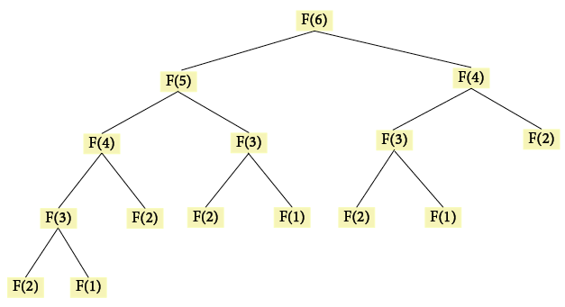

*photo by [@edgarraw](https://unsplash.com/@edgarraw)*

# Memoization and Recursion

For my last [blog post](https://dev.to/ionabrabender/recursion-revealed-4gn3), I examined recursion and looked at some basic examples of how we could implement it. While I was learning about recursion, I kept coming across this word - **memoization**. I wasn't sure what it meant or why it was relevant, so I decided to investigate further. In this post, I'll be talking about why memoization can be an important factor when implementing recursion and giving an example of how it might be used.

## What is Memoization?

Memoization is a way to potentially make functions that use recursion run faster. As I'll show in an example below, a recursive function might end up performing the same calculation with the same input multiple times. This means it could end up taking longer than the iterative alternative. A memoization function allows us to store input alongside the result of the calculation. Therefore, rather than having to do the same work again using the same input, it can simply return the value stored in the cache.


*photo by [@yespanioly](https://unsplash.com/@yespanioly)*

### Memoization and Fibonacci

To really understand memoization, I found it useful to look at how it is used when using recursion to calculate the *nth* number in the Fibonacci sequence. This is a very common example and could definitely be something you're asked to implement in a technical interview.

An initial recursive solution might look something like this:

```javascript
function recursiveFibonacci(n) {

  if (n <= 1) {
      return n;
  }

  return recursiveFibonacci(n-1) + recursiveFibonacci(n-2);

}

recursiveFibonacci(6);
// 8

recursiveFibonacci(10);
// 55

recursiveFibonacci(20);
// 6765
```

**If you're unclear on how recursion works, you can look at my previous [blog post](https://dev.to/ionabrabender/recursion-revealed-4gn3) which provides an overview of recursion, or [this post](https://medium.com/launch-school/recursive-fibonnaci-method-explained-d82215c5498e) which specifically tackles recursion and the fibonacci sequence.*

Yey, it works! But, while this function is just a couple of lines long, it's hugely inefficient and would take longer than the iterative alternative. The runtime is exponential, meaning that whenever we increase the input by 1, there is a huge growth in terms of how long it takes to compute. This is because the function is being called multiple times with the same arguments.

We can see in this diagram how that happens:



*Recursive Fibonacci Function in Tree Representation*

When the input is 6, the function makes several recursive calls with each of the numbers preceding 6. For instance, F(2) is called five times! While this might not have a huge effect here, we can imagine how negatively the runtime would be impacted when our input was, say, 1,000. Evidently, we need a better solution.


*photo by [@steffipereira](https://unsplash.com/@steffipereira)*

Memoization to the rescue! With a memoization function, we can create a cache where we store inputs with their calculated results. Then, whenever we have an input that we've already seen, we can simply retrieve the result rather than redoing any of our work.

Below, we can see an example of how such a function might be created:

``` javascript
// We've separated out the memoization function from our Fibonacci calculating function to allow it to be reused.
function memoize(fn) {

    // We create the cache which we'll use to store the inputs and calculated results.
    const memoCache = {};

    return function(n) {

        // We can check if we've already performed a calculation using the given input.
        // If we have, we can simply return that result.
        if(memoCache[n]) {
            return memoCache[n];
        }

        // If we don't find the current input in our cache, we'll need to perform the calculation.
        // We also need to make sure we store that input and result for future use.
        const result = fn(n);
        memoCache[n] = result;
    
        return result;

    }

}

// Our recursiveFibonacci function can remain the same.
function recursiveFibonacci(n) {

    if (n <= 1) {
        return n;
    }

    return recursiveFibonacci(n - 1) + recursiveFibonacci(n - 2);

}

// We reassign recursiveFibonacci to our memoize function with recursiveFibonacci passed as the argument.
recursiveFibonacci = memoize(recursiveFibonacci);

recursiveFibonacci(6);
// 8

recursiveFibonacci(10);
// 55

recursiveFibonacci(20);
// 6765
```

Great! We now have a more efficient recursive solution which avoids redoing the same work. Additionally, as this is a pretty generic function, we could even reuse it in combination with other recursive functions. In that case, you might also want to increase the number of arguments the function is able to take, for instance using ...args, in order to make it more abstract.

### A Note on Memoization
By creating a cache, we're using additional space, so you have to decide whether that's worth the improved speed. If you have a very large range of inputs where it's fairly unlikely that you'll need to repeat the same calculations, memoization may not be an efficient solution after all.


### Sources

1. "[Understanding JavaScript Memoization In 3 Minutes](https://codeburst.io/understanding-memoization-in-3-minutes-2e58daf33a19)", Codesmith on codeburst.io, Accessed November 20, 2020
2. "[Implementing Memoization in Javascript](https://medium.com/@reallygordon/implementing-memoization-in-javascript-5d140bb04166)", Arielle Gordon on Medium, Accessed November 20, 2020
3. "[Recursive Fibonacci Method Explained](https://medium.com/launch-school/recursive-fibonnaci-method-explained-d82215c5498e)", Bennie van der Merwe with LaunchSchool on Medium, Accessed November 20, 2020