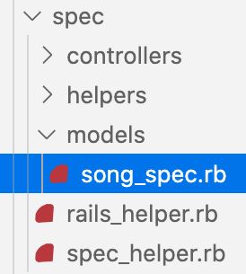

*photo by [@estudiobloom](https://unsplash.com/@estudiobloom)*

# RSpec and Rails

Testing is a vital stage in the development of any application and is a way to ensure that everything works as expected. One aspect that you'll probably want to test in your Ruby on Rails applications is whether your **CRUD** (Create, Read, Update, and Destroy) actions have been successful. This post will examine how we can use RSpec to do this.

## What is RSpec?

RSpec is the most common testing tool for Ruby. It was created for behaviour-driven development (BDD), meaning that tests should be specified in terms of the desired behaviour of the program. If you want to learn more about BDD and RSpec, you can find a good overview [here](https://semaphoreci.com/community/tutorials/getting-started-with-rspec#:~:text=RSpec%20is%20a%20testing%20tool,can%20start%20using%20rather%20quickly.).

RSpec can be used to test any Ruby code. In this example, we'll be using RSpec Rails, which extends RSpec and Ruby on Rails to allow you to specifically test Rails applications.

## Implementing Your Tests

### 1. Install Rails RSpec

We first need to install the rspec-rails gem. We can do that like so:

1. Include ```gem 'rspec-rails', '~> 3.4', '>= 3.4.2'``` in the :development, :test group in your gemfile. This is what it looks like in my gemfile:

```ruby
group :development, :test do
    gem 'byebug', platforms: [:mri, :mingw, :x64_mingw]
    gem 'rspec-rails', '~> 3.4', '>= 3.4.2'
end
```

*Note: You can find the most recent version of the rspec-rails gem [here](https://rubygems.org/gems/rspec-rails/).*

2. Run bundle install in the terminal to install the gems specified in your gemfile.
3. Run ```rails generate rspec:install``` to generate the spec files necessary for running your RSpec tests. This includes files for testing your models, controllers, and helpers and can be found in the newly created spec folder.

### 2. Create an Instance to Test

In these examples, we'll be writing tests which are directed at the Song class. I'll be writing these tests in the song_spec.rb file in the model directory, however, as I've covered below, these tests are by no means the only ones you might want to include in your model testing. Additionally, as you move forward with your application, you may also want to relocate these tests to the controller directory, depending on your preference.

If you ran ```rails generate rspec:install``` **after** setting up the model you want to test in your Rails application, your test files should have been automatically generated. Inside the newly created spec directory, you should find a models folder. Within that, you should find a file named [name of your model]_spec.rb. If you don't have that file, simply create a new file within the spec folder and ensure you use the [name of your model]_spec.rb naming convention.

For me, this file is called song_spec.rb. My spec folder looks like this:



This file should contain some initial code, which will form the basis for your tests. For me, it looks like this:

```ruby
require 'rails_helper'

RSpec.describe Song, type: :model do

end
```

This code shows that we are setting up an RSpec test for our Song class. The tests will be aimed at our model and we can write our code inside this block.

Before we can check if our CRUD actions work as expected, we need to create an instance of the Song class. To do that, we can set up a before(:all) do ... end block, like so:

```ruby
RSpec.describe Song, type: :model do

  before(:all) do

  end

end
```

Using before(:all) allows us to specify what we would like to happen before we start testing. :all means that this block of code runs once before all of our tests run. Alternatively, we can use :each if we want something to run before each individual CRUD test.

We then need to create an instance of the Song class, which will be used as the basis for all of our tests. We can do that like so:

```ruby
before(:all) do
    @song = Song.create(title: "Like a Rolling Stone", artist: "Bob Dylan", album:"Highway 61 Revisited", release_date: 1965)
end
```

*It might seem counterintuitive to first create an instance before performing our tests. What we're really doing is trying each of our CRUD actions on our @song instance and then checking if they have been successful.*


*photo by [@matyszczyk](https://unsplash.com/@matyszczyk)*

### 3. Create Your CRUD Tests

#### Create

The first CRUD action we want to test is **create**. This is fairly straightforward - we simply check if the @song instance we created above is valid. The first step is to create an it do ... end block. After the it, we include a string which describes what the test is doing, like so:

```ruby
it 'checks that a song can be created' do

end
```

We can then add the test code, like so:

```ruby
it 'checks that a song can be created' do
    expect(@song).to be_valid
end
```

This code does exactly what it says - it checks if @song is valid and returns true or false depending on the result. If @song is valid, our test will pass. If the result is false, we know that our create action has been unsuccessful and that there is a bug in our code, which we need to locate and fix.

**To perform the test, run ```rspec``` in your terminal.**

#### Read

The rest of our tests will follow the same pattern as the create test. We first create an it do ... end block describing what the test does, before filling in the code which checks if the action was successful.

Here, we want to check if we can **read** the instance of the instance we created at the beginning. In this test, we find the song with the same title as the original @song instance and check if the result equals @song. If it does, our test has been successful. If not, there's a problem with our read action. 

```ruby
it 'checks that a song can be read' do
    expect(Song.find_by_title("Like a Rolling Stone")).to eq(@song)
end
```

#### Update

In this test, we want to check if we can **update** our @song instance. We can do that by first using the update method to change the title of the song and then searching for a song with the updated title. If the returned instance is equal to @song, we know our update has worked correctly.

```ruby
it 'checks that a song can be updated' do
    @song.update(:title => "Like a Rolling Stone - Remastered")
    expect(Song.find_by_title("Like a Rolling Stone - Remastered")).to eq(@song)
end
```

#### Destroy

Finally, we want to check that we can destroy our instance. We can do this by first using the destroy method on our @song instance. We then check the total number of instances in the Song class. Because of the way our tests are set up and the fact that we've only created one instance, we can simply check that the Song.count is equal to 0 after that one instance has been destroyed. If an instance of the Song class still exists, @song has not been successfully destroyed and our test will fail. If the count is 0, everything has worked as it should.

```ruby
it 'checks that a song can be destroyed' do
    @song.destroy
    expect(Song.count).to eq(0)
end
```
Of course, if you've created other instances, this test won't work correctly. In that case, you could do something like this.

```ruby
it 'checks that a song can be destroyed' do
    @song.destroy
    expect(Song.find_by(title: "Like a Rolling Stone - Remastered")).to be_nil
end
```

## A Note on RSpec

In this post we've only discussed testing CRUD actions. It's likely you'll want to include other tests, for instance for your validations. You may also want to test your controllers. You can add these tests to the relevant files in your controllers directory inside the specs folder, which will have been created when you ran ```rails generate rspec:install```. Depending on how you've set up your app and what aspects you're hoping to test, it might make more sense for you to test your CRUD actions here.

The examples shown are just one way to write your RSpec tests. Ruby Guides provides many more examples [here](https://www.rubyguides.com/2018/07/rspec-tutorial/).

## Sources

1. "[rspec-rails](https://rubygems.org/gems/rspec-rails/versions/3.4.2)", rubygems, Accessed December 7, 2020
2. "[TDD Basics: How to Write an RSpec Test](https://dev.to/jeremy/rspec-from-scratch-part-1-how-to-write-a-test-4ce8)", Jeremy Schuurmans on DEV, Accessed December 7, 2020
3. "[Getting Started with RSpec](https://semaphoreci.com/community/tutorials/getting-started-with-rspec#:~:text=RSpec%20is%20a%20testing%20tool,can%20start%20using%20rather%20quickly.)", Marko Anastasov on Semaphore, Accessed December 8, 2020
4. "[The Definitive RSpec Tutorial With Examples](https://www.rubyguides.com/2018/07/rspec-tutorial/)", Ruby Guides, Accessed December 8, 2020